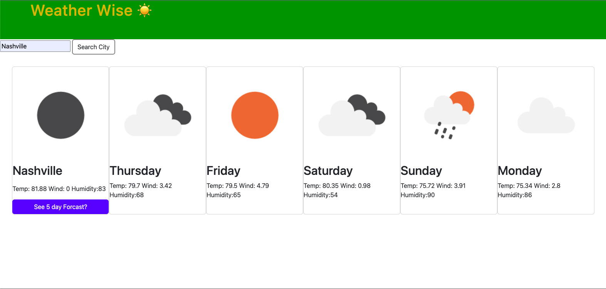

# Weather Wise: Forecast Website

5 day weather forecast site utilizing 3rd Party APIs

### Description

Weather Wise presents users with the ability to search for the current weather in a city. After doing so, the user then has the option to expand the search for weather in the searched location for the next 5 days. OpenWeather Api was used in the creation of this site.

### To Do

-- Coding to ensure that cards are replaced rather than only added if user does multiple searches.
-- Additional syling?

### Links

Weather Wise Site
https://widewanderer.github.io/Weather-Forecast-Website-/

Git Hub
https://github.com/Widewanderer/Weather-Forecast-Website-

### Screenshots

